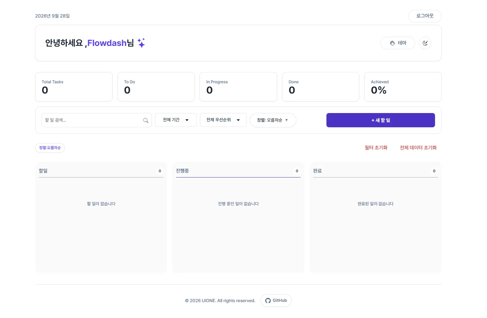
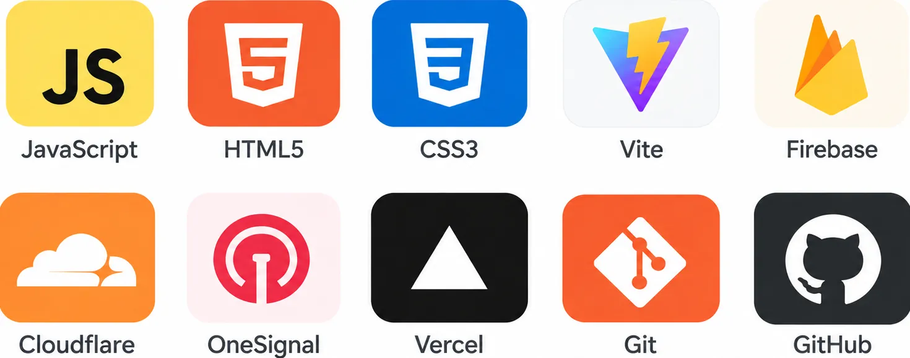
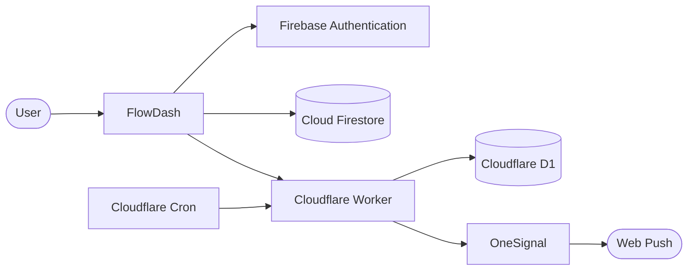

# FlowDash

> **할 일의 흐름부터 일정과 알림까지 관리하는 개인 생산성 대시보드**

FlowDash는 `TODO → DOING → DONE`의 작업 흐름을 기반으로 할 일을 관리하고,  
검색·필터·정렬, 만기일, 예약 알림, 사용자 인증 및 개인화 테마를 제공하는 웹 애플리케이션입니다.

초기에는 **UIONE 팀의 칸반 기반 Todo 프로젝트**로 시작했으며,  
이후 개인 리팩터링을 통해 Firebase 기반 사용자 인증 및 데이터 저장,  
Web Push 예약 알림, 사계절 테마, 접근성 및 반응형 UX 등을 추가하여 확장했습니다.



## 🔗 서비스

- **Live Demo**: [FlowDash 바로가기](https://flowdash-tau.vercel.app/)
- **GitHub**: [Naeun-K/flowdash](https://github.com/Naeun-K/flowdash)

---

## 📌 프로젝트 소개

여러 업무를 동시에 관리할 때 현재 해야 할 일과 진행 중인 일,  
완료한 일을 빠르게 구분하기 어렵고 마감 일정을 놓치기 쉽습니다.

FlowDash는 업무 상태를 **TODO / DOING / DONE**으로 시각적으로 구분하고,  
우선순위와 만기일을 함께 관리할 수 있도록 설계했습니다.

단순한 Todo 기록을 넘어 사용자별 데이터 저장과 예약 알림을 지원하여  
자신의 작업 흐름을 지속적으로 관리할 수 있는 개인 생산성 도구로 확장했습니다.

### 핵심 목표

- **작업 흐름 시각화** — TODO / DOING / DONE 기반 상태 관리
- **일정 관리** — Todo별 우선순위와 만기일 관리
- **작업 탐색** — 검색, 필터 및 정렬
- **사용자별 데이터 관리** — Firebase 기반 인증 및 데이터 저장
- **일정 알림** — 만기일 기준 Web Push 예약 알림
- **개인화** — Light / Dark 및 사계절 테마
- **접근성** — 키보드, ARIA, 터치 환경을 고려한 UI

---

## ✨ 주요 기능

### 🔐 사용자 인증

- 이메일 / 비밀번호 회원가입 및 로그인
- 로그인 상태 유지
- 사용자별 Todo 데이터 관리
- 비밀번호 조건 실시간 확인
- 인증 오류별 사용자 피드백

### ✅ Todo 관리

- Todo 생성 / 수정 / 삭제
- `TODO / DOING / DONE` 상태 관리
- 높음 / 중간 / 낮음 우선순위 설정
- 만기일 설정
- 생성 / 수정 / 완료 시간 관리
- 완료 Todo의 알림 설정 비활성화

### 🔍 검색 · 필터 · 정렬

- 제목 및 내용 검색
- 기간별 필터
- 우선순위별 필터
- Todo 정렬
- 검색 및 필터 상태 유지

### 🔔 예약 알림

- Todo별 만기일 설정
- 만기일 기준 복수 알림 예약
- 만기일 변경 시 알림 시간 자동 재계산
- OneSignal을 이용한 Web Push
- 완료된 Todo의 예약 알림 해제

### 📊 대시보드

- 전체 Todo 현황
- TODO / DOING / DONE 상태별 확인
- Todo 달성률
- 현재 날짜 및 시간
- 시간대별 Greeting
- 사용자 닉네임

### 🎨 개인화

- 사용자 닉네임
- Light / Dark 테마
- Spring / Summer / Autumn / Winter 테마
- 계절별 애니메이션
- 테마별 SVG 아이콘

### 📱 반응형 · 접근성

- Desktop / Tablet / Mobile 대응
- 키보드 접근성
- ARIA 적용
- Dialog 및 포커스 관리
- Light / Dark 환경의 색상 대비 개선
- Touch 환경의 날짜·시간 입력 UX 대응

---

## 📖 사용 방법

### 1. 회원가입 및 로그인

FlowDash에 처음 접속했다면 이메일과 비밀번호를 입력하여 회원가입합니다.

로그인 후 Todo를 생성하면 로그인한 사용자별로 데이터가 저장되며,  
로그아웃하기 전까지 로그인 상태가 유지됩니다.

### 2. Todo 등록

`새 할 일 추가` 버튼을 눌러 Todo를 등록합니다.

Todo에는 다음 정보를 설정할 수 있습니다.

- 제목
- 내용
- 우선순위
- 만기일

등록된 Todo는 `TODO` 상태에서 시작하며 작업 진행 상황에 따라 다음과 같이 상태를 변경할 수 있습니다.

```text
TODO → DOING → DONE
```

### 3. 알림 권한 허용 🔔

> [!IMPORTANT]
> 예약 알림을 사용하려면 **브라우저의 알림 권한을 먼저 허용해야 합니다.**

FlowDash 화면 **우측 하단에 있는 빨간색 종 아이콘**을 누릅니다.

```text
화면 우측 하단
      ↓
  🔔 종 아이콘
      ↓
브라우저 알림 권한 요청
      ↓
    [허용]
```

브라우저에서 알림 권한 요청이 나타나면 **허용**을 선택해주세요.

알림 권한을 허용하지 않으면 Todo에 알림을 예약하더라도  
Web Push 알림을 받을 수 없습니다.

이미 브라우저에서 알림을 차단한 경우에는 브라우저의 사이트 권한 설정에서  
FlowDash의 알림 권한을 다시 허용해야 합니다.

### 4. 만기일 및 알림 설정

Todo의 만기일을 지정한 뒤 `알림 설정` 버튼을 통해 원하는 알림 시간을 추가할 수 있습니다.

예를 들어 다음과 같이 여러 개의 알림을 설정할 수 있습니다.

```text
만기일
2026. 09. 30. 18:00

알림
├── 1일 전
├── 1시간 전
└── 10분 전
```

알림은 Todo의 만기일을 기준으로 계산됩니다.

만기일을 변경하면 기존 알림 시간도 새로운 만기일을 기준으로 다시 계산되며,  
Todo를 `DONE` 상태로 변경하면 해당 Todo의 알림 설정이 비활성화됩니다.

### 5. 검색 및 필터

검색창과 필터 기능을 이용하여 원하는 Todo를 빠르게 찾을 수 있습니다.

- 키워드 검색
- 기간별 필터
- 우선순위별 필터
- 정렬

조건을 조합하여 현재 필요한 Todo만 확인할 수 있습니다.

### 6. 테마 변경

테마 메뉴에서 기본 Light / Dark 테마와 사계절 테마를 선택할 수 있습니다.

```text
Light / Dark

🌸 Spring
🌊 Summer
🍂 Autumn
❄️ Winter
```

선택한 테마에 따라 화면의 색상, 계절 애니메이션 및 일부 SVG 아이콘이 변경됩니다.

---

## 🛠 기술 스택



### Frontend

**JavaScript · HTML5 · CSS3 · Vite**

애플리케이션의 UI와 Todo 관리 기능을 구현하고 Vite를 통해 프로젝트를 빌드합니다.

### Firebase

**Firebase Authentication · Cloud Firestore**

Firebase Authentication을 통해 사용자 인증을 처리하고,  
Cloud Firestore에 사용자별 Todo 데이터를 저장합니다.

### Notification

**Cloudflare Workers · Cloudflare D1 · OneSignal**

Cloudflare Workers와 D1을 이용해 예약 알림을 관리하고,  
OneSignal을 통해 Web Push 알림을 발송합니다.

### Deployment & Collaboration

**Vercel · Git · GitHub**

Frontend 배포와 프로젝트 버전 관리 및 협업에 사용합니다.

---

## 🏗 시스템 아키텍처



FlowDash의 데이터와 기능은 목적에 따라 역할을 분리했습니다.

**Firebase**는 사용자 인증과 Todo 데이터 저장을 담당하며,  
**Cloudflare Workers와 D1**은 미래 시점에 처리해야 하는 예약 알림을 관리합니다.

예약 시간이 되면 Cloudflare Worker가 OneSignal을 통해  
사용자의 브라우저로 Web Push 알림을 전달합니다.

---

## 🗃 데이터 구조

### Cloud Firestore

Todo는 Firebase UID를 기준으로 사용자별로 분리하여 저장합니다.

```text
users
└── {uid}
    └── todos
        └── {todoId}
            ├── id
            ├── title
            ├── content
            ├── priority
            ├── status
            ├── dueAt
            ├── notifications
            ├── createdAt
            ├── updatedAt
            └── completedAt
```

이를 통해 각 사용자의 Todo 데이터를 독립적으로 관리합니다.

### Cloudflare D1

예약된 알림은 Todo 데이터와 분리하여 D1에서 관리합니다.

```text
notifications
├── user_id
├── todo_id
├── notification_id
├── title
├── notify_at
├── due_at
├── status
└── sent_at
```

**Firestore**는 Todo 자체의 데이터를 관리하고,  
**D1**은 미래에 발송해야 하는 예약 알림 데이터를 관리합니다.

---

## 💡 주요 기술 구현

### LocalStorage → Firestore

초기 팀 프로젝트에서는 Todo 데이터를 브라우저의 LocalStorage에 저장했습니다.

이 방식은 구현이 간단하지만 데이터가 특정 브라우저에 종속되고  
사용자별 데이터를 관리하기 어렵다는 한계가 있었습니다.

개인 리팩터링 과정에서 Firebase Authentication과 Firestore를 도입하여  
로그인한 사용자별로 Todo 데이터를 관리할 수 있도록 변경했습니다.

```text
Before

Browser
└── LocalStorage
```

```text
After

Firebase Authentication
        ↓
    사용자 UID
        ↓
Cloud Firestore
        ↓
users/{uid}/todos/{todoId}
```

이를 통해 특정 브라우저에 종속되었던 Todo 데이터를  
사용자 계정을 기준으로 관리할 수 있게 되었습니다.

### 서버리스 예약 알림

브라우저의 `setTimeout()`과 같은 타이머에만 의존하면  
페이지가 닫히거나 브라우저가 백그라운드 상태가 되었을 때  
미래 시점의 알림을 안정적으로 처리하기 어렵습니다.

이를 해결하기 위해 예약 알림 정보를 Cloudflare D1에 저장하고,  
Cloudflare Cron과 Worker가 발송해야 할 알림을 확인하도록 구성했습니다.

```text
Todo 만기일
    ↓
알림 예약
    ↓
Cloudflare D1
    ↓
Cloudflare Worker
    ↓
OneSignal
    ↓
Web Push
```

따라서 사용자가 FlowDash 페이지를 계속 열어 두지 않아도  
예약된 알림을 처리할 수 있습니다.

### Todo와 예약 알림 동기화

Todo는 Firestore, 예약 알림은 D1에서 관리하기 때문에  
두 데이터의 상태가 서로 달라지지 않도록 동기화했습니다.

```text
만기일 변경
└── 예약 알림 시간 재계산

Todo 완료
└── 예약 알림 해제

Todo 삭제
└── 예약 알림 함께 삭제
```

이를 통해 Todo의 상태 변화가 예약 알림에도 함께 반영되도록 구성했습니다.

### 기능별 모듈화

JavaScript 코드를 기능별 모듈로 분리하여 각 파일의 책임을 명확하게 구성했습니다.

```text
Application
├── Authentication
├── Todo
├── Filter & Sort
├── Dashboard
├── Notification
├── Theme
└── Nickname
```

`main.js`는 각 기능을 직접 구현하기보다 필요한 모듈을 초기화하고 연결하는  
애플리케이션의 진입점 역할을 담당합니다.

---

## 📂 프로젝트 구조

```text
flowdash/
│
├── img/
│   ├── 2nd-tech.webp
│   ├── autumn.webp
│   ├── readme-main.webp
│   ├── spring.webp
│   ├── summer.webp
│   └── winter.webp
│
├── public/
│   ├── push/
│   │   └── onesignal
│   │        └── OneSignalSDKWorker.js
│   └── favicon.webp
│
├── scripts/
│   ├── icon/
│   │   └── 기본 / 계절별 SVG 아이콘
│   │
│   ├── lib/
│   │   ├── Firebase Authentication
│   │   ├── Cloud Firestore
│   │   └── OneSignal
│   │
│   ├── theme/
│   │   └── 사계절 테마 및 애니메이션
│   │
│   ├── utils/
│   │   └── 공통 유틸리티
│   │
│   ├── auth-ui.js
│   ├── dashboard.js
│   ├── filter.js
│   ├── main.js
│   ├── nickname.js
│   └── todo-manager.js
│
├── styles/
│   ├── reset.css
│   ├── variables.css
│   ├── style.css
│   └── season-effects.css
│
├── flowdash-notifications/
│   ├── migrations/
│   │   └── D1 Migration
│   │
│   ├── src/
│   │   └── index.js
│   │
│   ├── package.json
│   └── wrangler.jsonc
│
├── index.html
└── README.md
```

---

## 👥 프로젝트 진행 과정

FlowDash는 **UIONE 4인 팀 프로젝트**로 시작했으며,  
프로젝트 종료 이후 개인적으로 기능과 구조를 확장했습니다.

### 초기 팀 프로젝트

- 칸반 기반 Todo Dashboard
- Todo 생성 / 수정 / 삭제
- TODO / DOING / DONE 상태 관리
- 검색 / 필터 / 정렬
- 반응형 UI
- LocalStorage 기반 데이터 저장

### 개인 확장 및 리팩터링

- Firebase Authentication 적용
- Firestore 기반 사용자별 Todo 저장
- 로그인 상태 유지
- 로그인 / 회원가입 UX 개선
- Todo 만기일 기능
- 복수 예약 알림
- OneSignal Web Push 연동
- Cloudflare Workers + D1 예약 알림 시스템 구축
- Todo와 예약 알림 동기화
- 완료 Todo의 알림 설정 비활성화
- Light / Dark 테마 개선
- 사계절 테마 및 SVG 아이콘 적용
- Mobile / Touch 환경 개선
- ARIA 및 키보드 접근성 개선
- Lighthouse 기반 접근성 개선
- JavaScript 모듈 구조 리팩터링

---

## 👨‍👩‍👧‍👦 초기 팀 구성

| 이름       | 주요 담당                                    |
| ---------- | -------------------------------------------- |
| **김나은** | HTML, CSS, Todo Modal, JavaScript, 반응형 UI |
| 김민지     | HTML, CSS, JavaScript, 반응형 UI             |
| 송유림     | HTML, CSS, 반응형 UI, Presentation           |
| 박진솔     | Reset CSS, CSS, 반응형 UI                    |

---

## 🔮 개선 예정

- 테스트 범위 확대
- 네트워크 오류에 대한 사용자 피드백 강화
- 접근성 지속 개선

---
